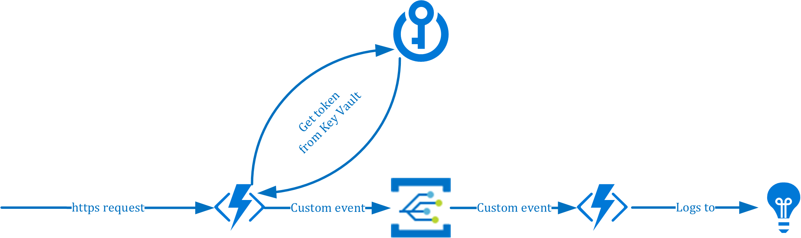

# Send custom events to Event Grid with Azure Functions (C#)

Start by provisioning the required Azure resources:
* Azure Storage Account used for the deployment of resources
* Azure Key Vault 
* Application Insights
* Azure Storage Account used for the Function Apps
* App Service Plan for the Function Apps
* Azure Function (The publisher function)
* Azure Function (The subscriber function)

