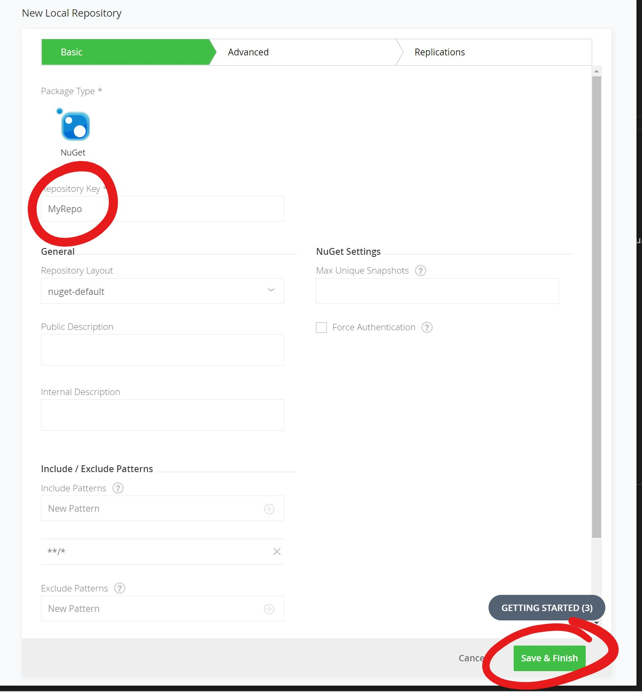

# Set up a private (and free) NuGet repository

This article will show you a simple way of securely setting up a private NuGet feed over the Internet and at the time of writing, at no cost. 
First of all, use Google Chrome are even the new Chromium Edge is not supported with JFrog.

# Create the subscription

Start by signing up for a [free cloud subscription at JFrog](https://jfrog.com/) using Google Chrome.

and make sure to select to host it in Azure.

Activate by the e-mail sent

Log in (still in Chrome)

# Delete default repos
Sign in to your subscription (https://<your subscription name>.jfrog.io) and navigate to Administration->Repositories. 
Hover over the repositories and remove the ones that was created by default.

# Add a new local repository
Create a new local repository and select package type NuGet when you are prompted.
When entering 'Repository Key' you should enter the name of your repository. It could be confusing that they are calling it key, when they actually mean name.

# Remove default permissions

Default permissions are:

