# Set up a private (and free) NuGet repository in Azure

This article will show you a simple way of securely setting up a private NuGet feed over the Internet and at the time of writing, at no cost. 
First of all, use Google Chrome are even the new Chromium Edge is not supported with JFrog.

#### 1. Create the subscription

Start by signing up for a [free cloud subscription at JFrog](https://jfrog.com/) using Google Chrome.

Click on the red circled button below to create a free cloud subscription.
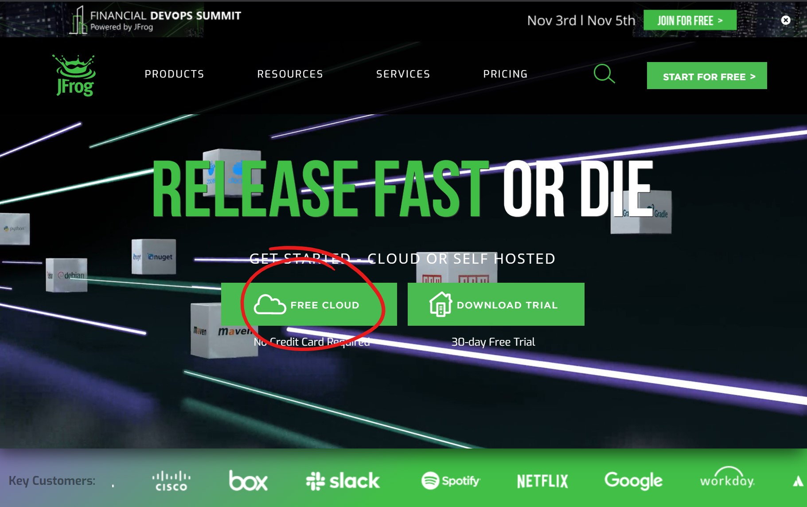

#### 2. Fill in the details. 
Make sure that Cloud is selected, and not self-hosted.
Also important as the title of this article, select **Microsoft Azure** as your cloud provider. 
Then fill in the fields as it's approporiate for you and click Proceed. Choose a wise name in the server details as this will be the address of your subscription and repository going forward. 
The article is using `blueish1` as an example.
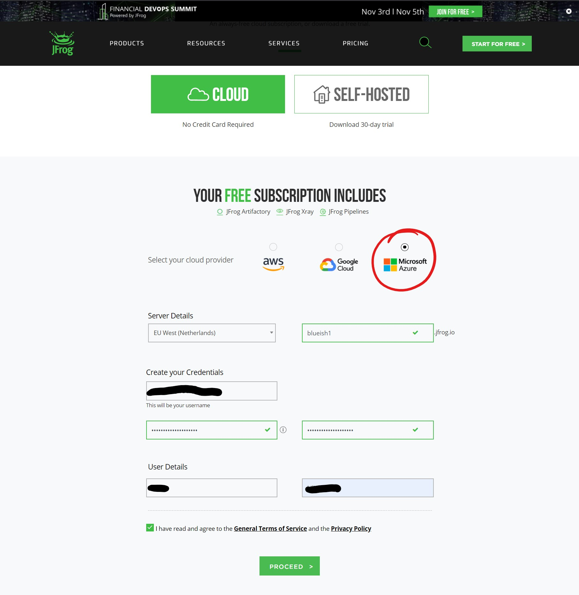

#### 3. Confirm your e-mail
You will get an e-mail sent to the address you entered in the form. Make sure to click on the link for activating yor subscription in the e-mail.

#### 4. Create a repository
While still using Chrome, browse to `https://blueish1.jfrog.io` (replace `blueish1` with the name of your subscription) and log in with the credentials you created in step 2. 

When you are logged in, click the *Create a Repository* button as shown below. 
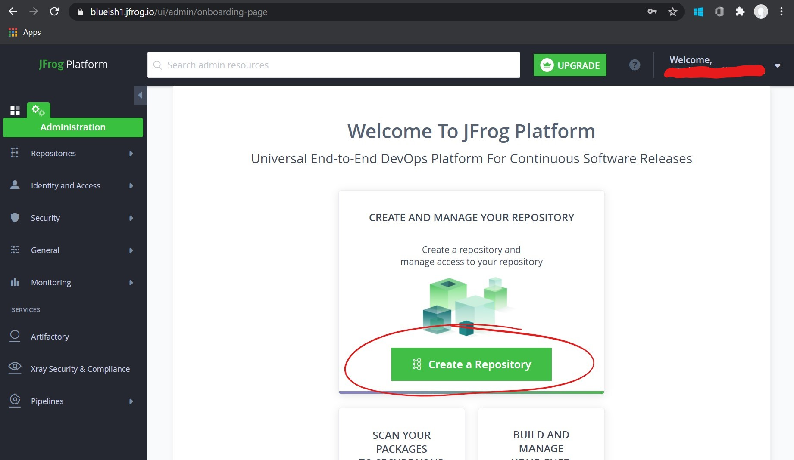

Then select *Create Local Repository*.
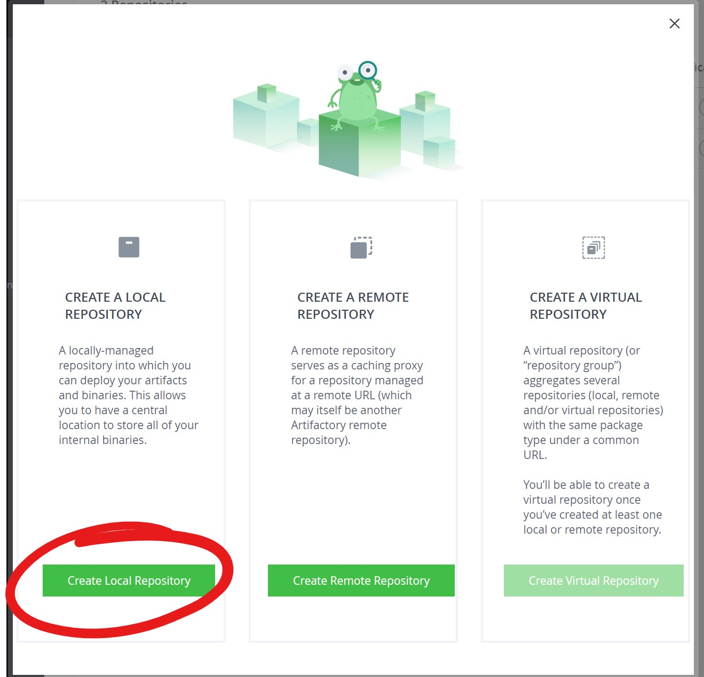

Continue by selecting the *NuGet* ikon to create a NuGet package repository.
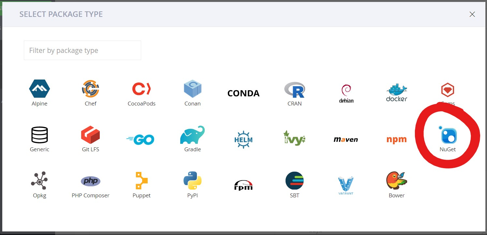

Now fill in the *Repository Key*, which essentially is the name of your repository, and check the *Force Authentication* checkbox so no anonymous connections can be made.
Nothing else needs to be filled in, so continue by clicking on *Save & Finish*.
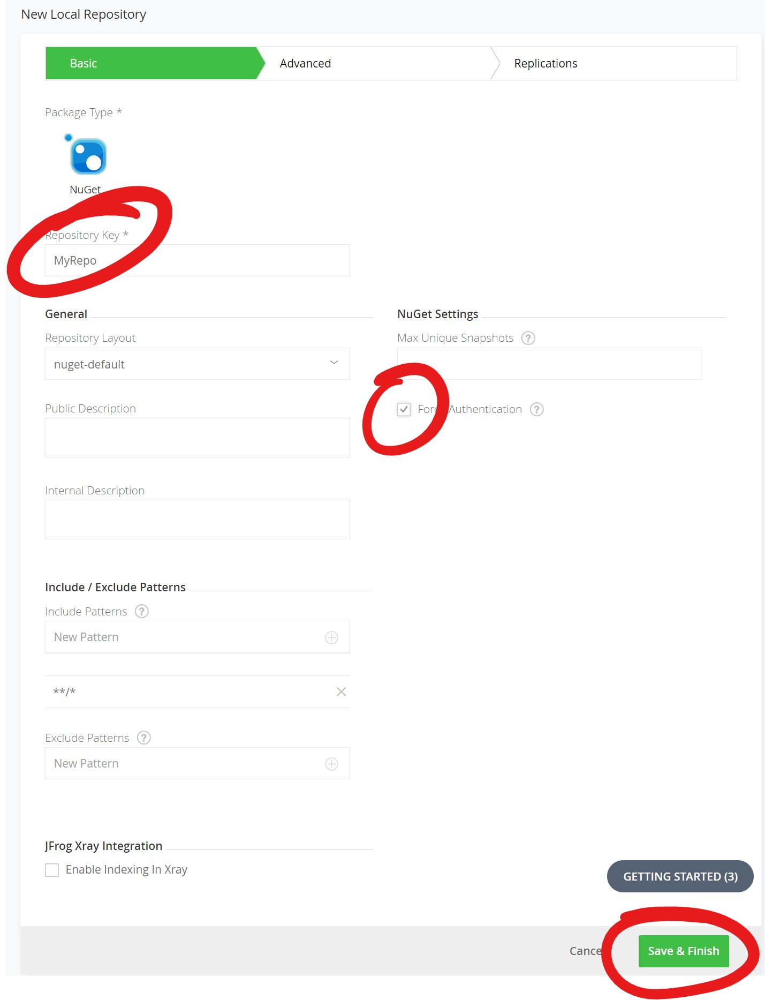

When the repository is created, just click on the X to close the message window.
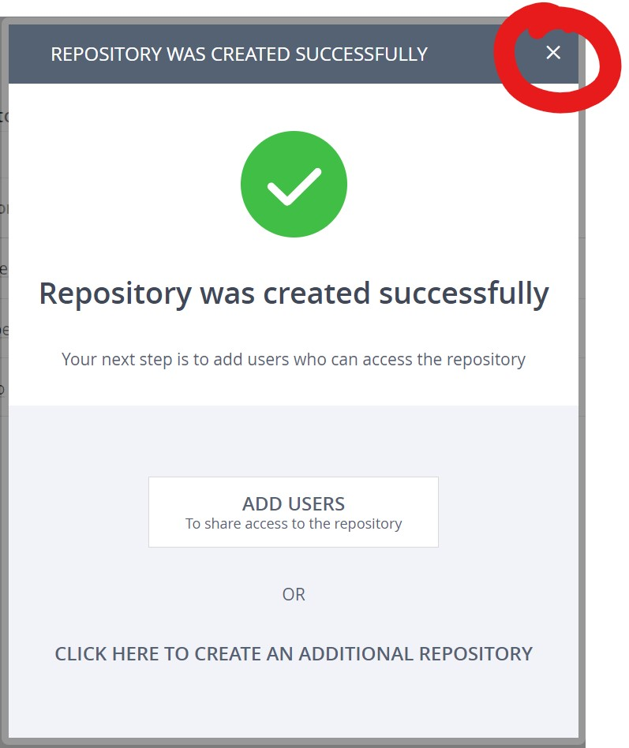

#### 5. Delete default repos
Hover over the repositories and remove the ones that was created by default (*example-repo-local* and *jfrogpipelines*).
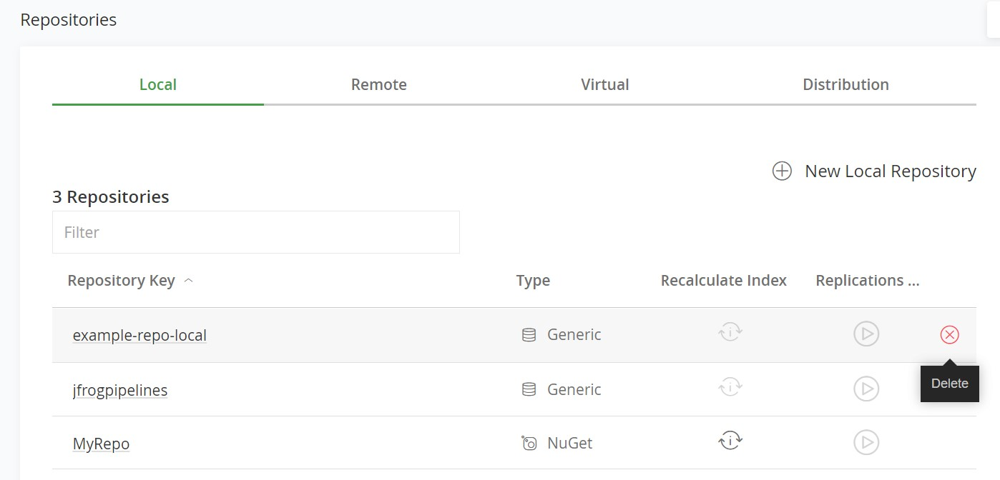

#### 6. Permissions
By default, you get a *readers* group, which all users are assigned to by default when they are created. The *readers* group has by default read access to repositories, builds and pipelines. 

Since we want to keep control and only give reading access to the NuGet repository to our users, we should stop new users from auto-joining the *readers* group and instead join a new group that we create, that only has read access to the NuGet Repository.

##### 6.1. Stop new users to auto-join the Reader group
Go to Administration->Groups and click *readers*. 
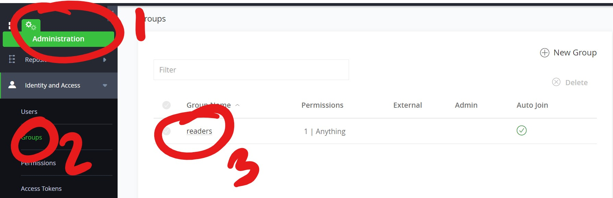
In the *readers* group settings, uncheck the box named *Automatically Join New Users to this Group* and click *Save*.
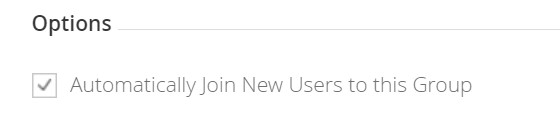

##### 6.2. Create a new group
Still on the page listing groups, click on *New Group*.
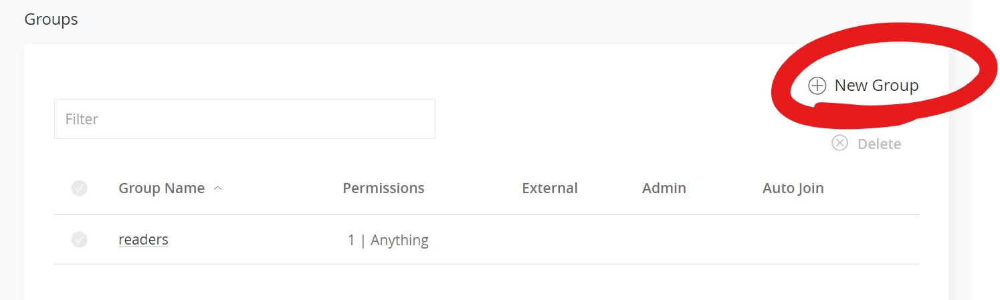
In the *New Group* page, enter a name for the group, check the box for the automatical joining of new user and click *Save*.
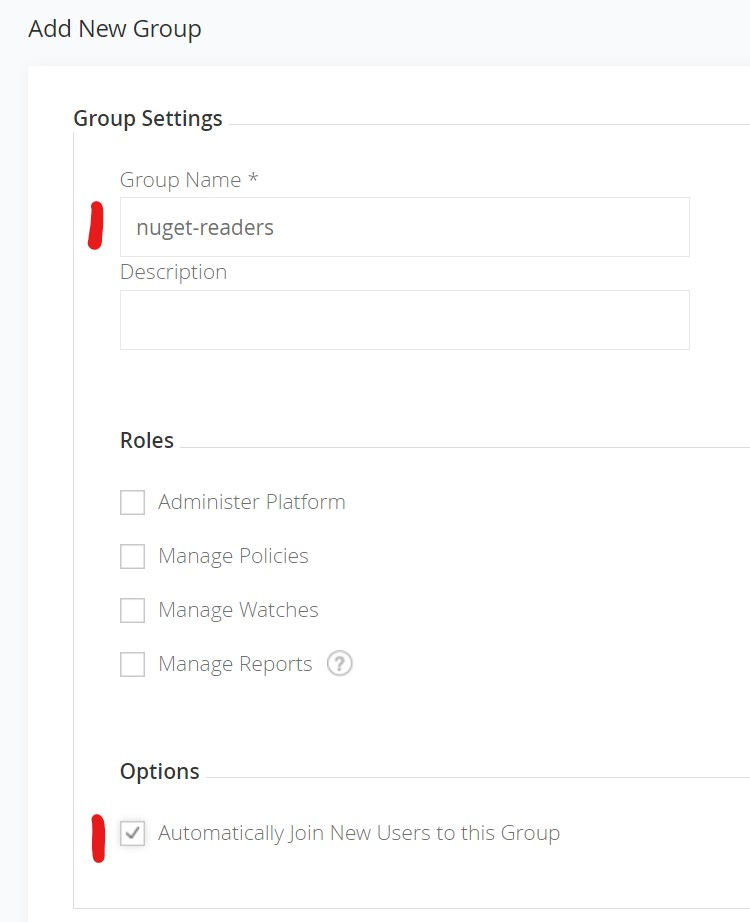

##### 6.3. Create a new permission
Click on *Permissions* in the left *Administration* menu to get to the *Permission* page. There click *New Permission*.
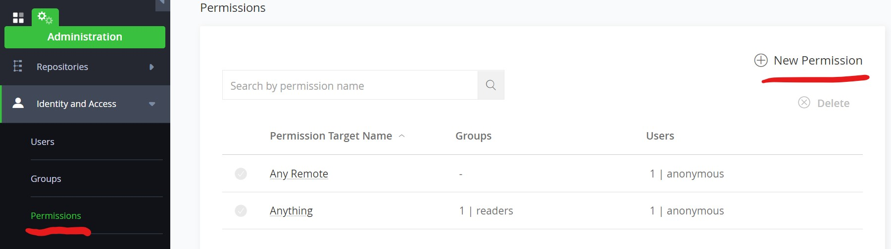

Type a name for the permission and then click the big plus sign to add a repository. In the new popup dialog, and select your repository, click the green arrow as by the image and the click *Save*.
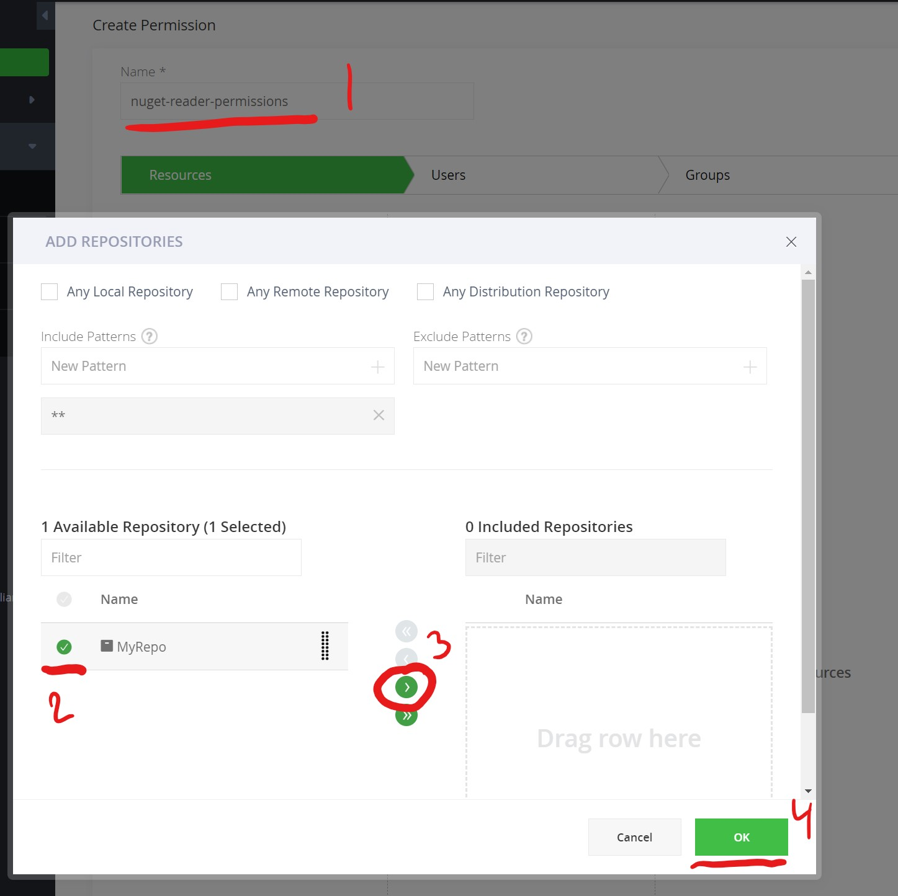

Now you should see one repository selected on the *Create Permission* page and nothing in the *Builds* or *Pipelines* area of the page. 
Click *Groups*.

When on the *Groups* page, click the green plus sign next to the *Selected Groups* label. In the new dialog that shows, select your newly created group, add it to the list by clicking on the green arrow, then click *OK*.
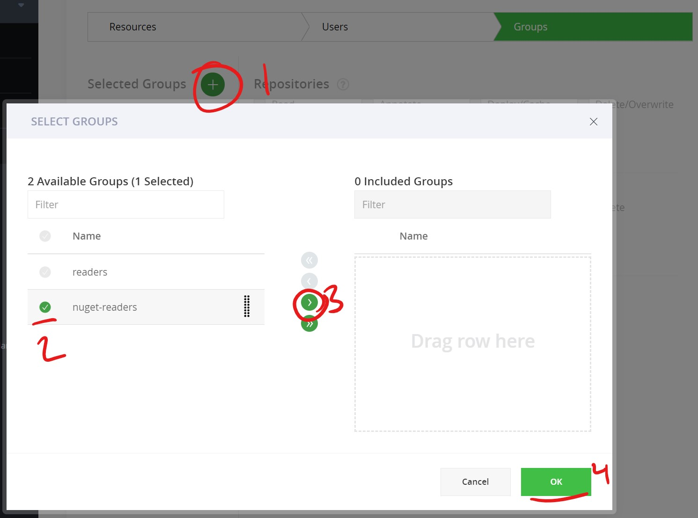

Check the *Read* checkbox for *Repositories* and then click *Create*.
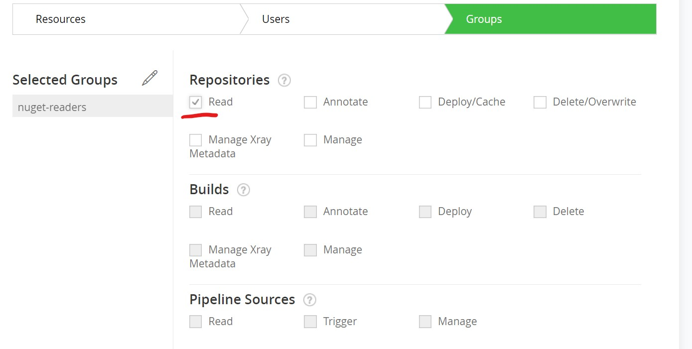

##### 7. Uploading NuGet packages
Alright, it's time to put the repository to the test and we should start by uploading a package. 
To do this, switch over from the *Administration* menu to the *Application* menu.
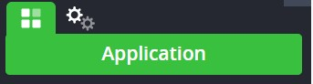
Click on *Artifactory* and *Artifacts*.
Then you should get to a view like the image below, where you should click *Set Me Up*.
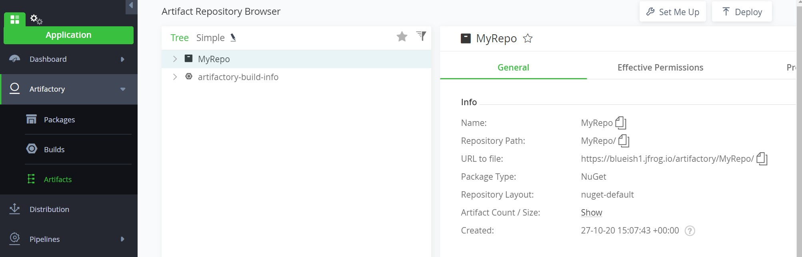
Here you have all the information you need to upload packages to the repository and if you fill in the password at the top, it's as easy as copying and pasting the rest. You can safely ignore the V3 instructions.
For a Visual Studio project, I navigated to the project folder and ran this command: 
`nuget sources Add -Name Artifactory -Source https://blueish1.jfrog.io/artifactory/api/nuget/MyRepo -username <my username> -password <my password>`
The output was:
`Package source with Name: Artifactory added successfully.`

Then, to authenticate against Artifactory with the NuGet API key, I ran the following command:
`nuget setapikey <my username>:<my password> -Source Artifactory`
The output was:
`The API Key '<my username>:<my password>' was saved for 'https://blueish1.jfrog.io/artifactory/api/nuget/MyRepo'.`

Finally, I could push my package to the NuGet repository using this command:
`nuget push bin\Debug\MyVsLibrary.1.0.1.nupkg -Source Artifactory`
The output was:
```
Pushing MyVsLibrary.1.0.1.nupkg to 'https://blueish1.jfrog.io/artifactory/api/nuget/MyRepo'...
  PUT https://blueish1.jfrog.io/artifactory/api/nuget/MyRepo/
  Created https://blueish1.jfrog.io/artifactory/api/nuget/MyRepo/ 1793ms
Your package was pushed.
```

###### 8. Testing anonynmous access
If we have configured everything correctly, we should not be able to access the NuGet feed without being prompted for credentials. Let's have a go and fire up Visual Studio and open any solution we might have, it does not matter which one. I select *Tools->NuGet Package Manager->Package Manager Settings*. In the dialog I enter the following:
Name: Artifactory
Source: `https://blueish1.jfrog.io/artifactory/api/nuget/MyRepo`
I got the source from the Artifactory view that opened up when I clicked on the *Set Me Up* button above.
Then I clicked *Update* and *OK*.
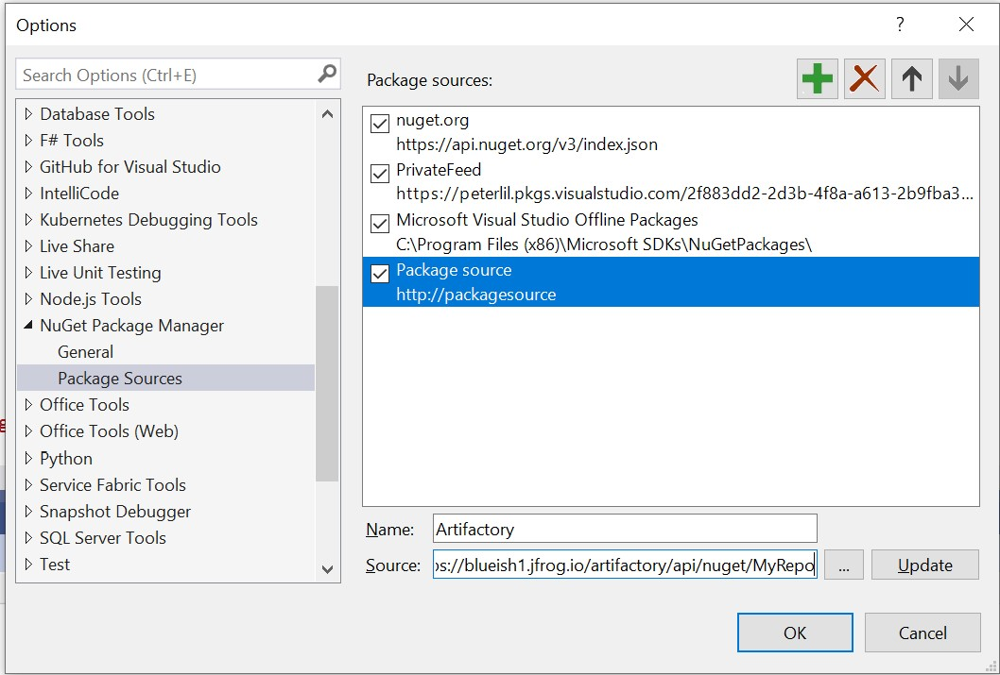
Then I click to manage the projects NuGet packages and select the Artifactory repo as *Package source*. 
And there it is! I get immediately prompted for a username and password. 
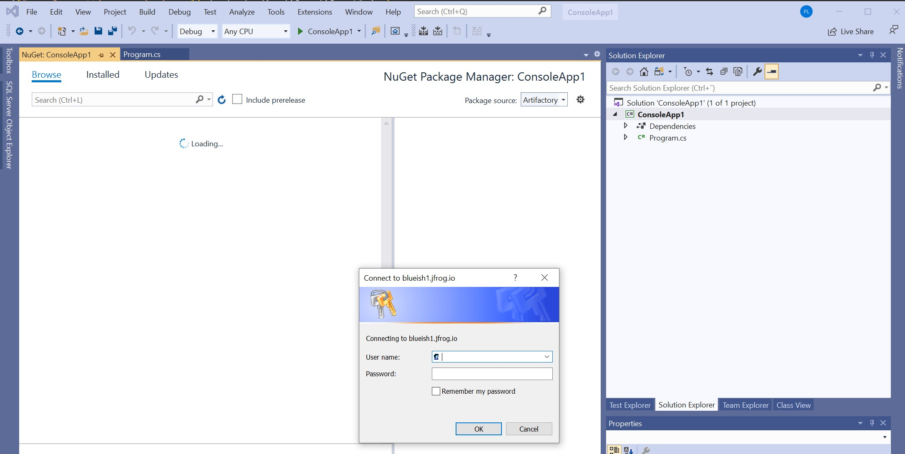

So I quickly went over to https://blueish1.jgrog.io and created a user account, entered username, e-mail and password to see if this new user would get access. 
And when entering the username and password in the credential dialog, I get access to the NuGet feed.
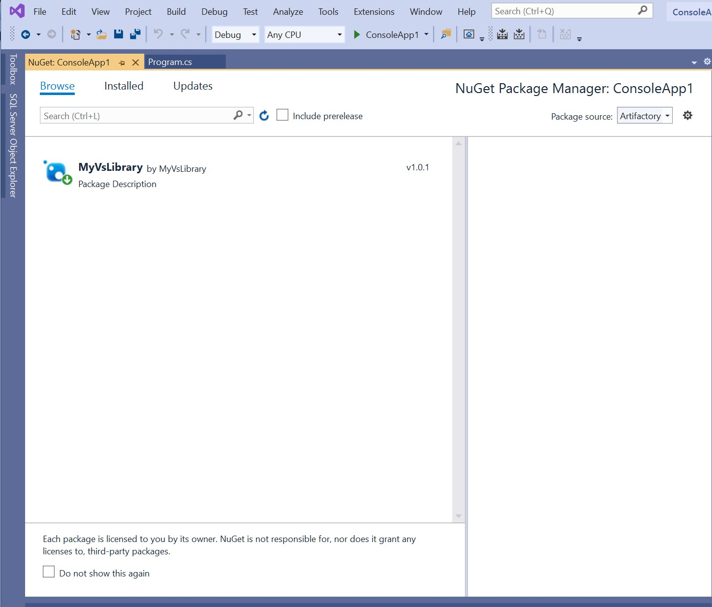
