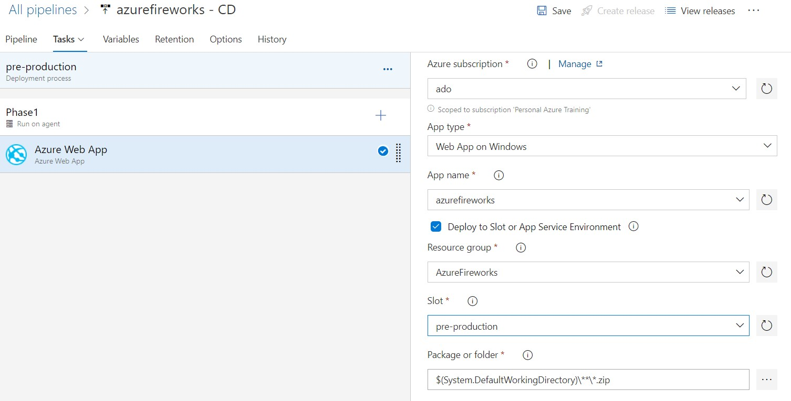
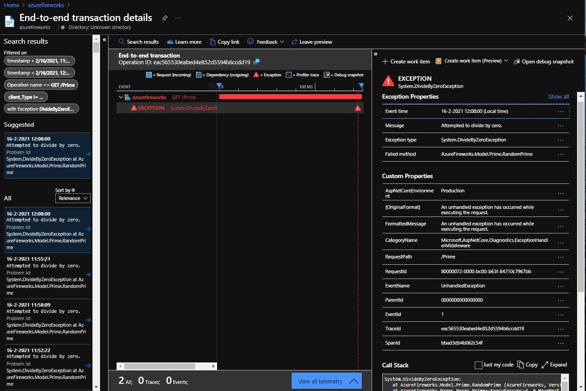

# Runbook for the Azure Fireworks session

## Preparations

The preparation steps takes you to where the session starts. All these resources and activities are a pre-requisite to go through with the session.

### Create a Resource Group

Create a *Resource Group* in your subscription in Azure. In this article we'll create a *Resource Group* named *AzureFireworks*. It does not matter in what region you place the *Resource Group* as the resources you create within can be located anywhere anyway.

### Create an App Service Plan

Create an *App Service Plan* and place it in the resource group. In this article it's called *ASP-AzureFireworks* and has the following configuration: \
 \
For this session it's important that it is a Windows plan and that it's at least an S1 plan as the activities below requires *Deployment Slots*.

### Create a Web App

Create a *Web App* as shown in the images below. \
Page 1 \
 \
Page 2 \
 \
Don't enable App Insights as that will be done in a later stage. 

### Create an Azure DevOps project

Create an *Azure DevOps* project, in this article it's called *Azure Fireworks*.
Make sure it uses git as source control. \

### Simulate load by creating four Logic Apps

To simulate load, create four *Logic Apps* that are configured like this: \
 \

The *Logic App* in the image is calling the start page. That is fine for one of the apps, the three other ones should target *https://<yourdomain>.azurewebsites.net/Prime*.

### Clone the AzureFirework.1 solution in to a local folder

In order to get the sample app, clone the *samples-and-demos* repo to a local folder. Then copy the project (sessions\azure-fireworks\AzureFireworks.1\.vs\AzureFireworks.1) to a new folder, so it's not connected to the *samplesa-and-demos* repo anymore.

### Add the solution to your Azure DevOps repo

Open the project in Visual Studio 2019 and click *Create Git Repository...* in the *Git Changes* window. \

In the new window, select *Existing remote* and enter the *Remote URL* (same URL you would use to clone from the remote), and click *Create and Push*.

## Session start

### Recap pre-requisites

We have a Windows App Service Plan. S1, a small plan but one that includes *Deployment Slots*. \
There's also a Web App with basic configuration and an Azure DevOps project with a *git* repo, where the demo project is kept.
Four Logic Apps are configured to simulate a very simple load pattern.

Make sure to start the app in VS to check that it's working.

### Deploy the solution to Azure

The simplest way for an individual developer to deploy a web app to Azure, is to do so using the *Publish* feature in Visual Studio. That will create a publishing profile, and deploy the application to Azure using that profile.

Start publishing by right-clicking on the project in *Solution Explorer* and select *Publish...*. That will bring up a publishing wizard.

Select Azure and click *Next*.

Select *Azure App Service (Windows)* and click *Next*.

End the wizard by clicking *Finish*. Now there's a publishing profile configured locally.

Save all files, commit all changes and click *Publish* to deploy the app to the *Azure Web App*.

When VS har finished publishing the app, it fires up the start page in your browser.

### Configure CI/CD

What is done so far is all fine for a project that you want to start small and fast. But in a professional project you would either right from the start, or at least pretty soon, need to involve a team of developers to the project. This can be done quite easily as the foundation is already there, meaning the source code is already in a distributed versioning system (git). However, adding more developers to a project instantiously requires source code integration, common build and release processes. For a small project such as this, it is very easy to add when using cloud services. You simply click the *Configure*-button in the *Continuous delivery* section below the publishing profile that was just created.

In th *Setup Azure Pipelines* window, the *Branch* field will populate itself, and in the *Subscription* field you need to select the right *Azure Subscription*. Then the *App Service* field will populate, and you can select the one created in the pre-requisites above.

After clicking *OK*, VS will configure a build and a release pipeline, and it will trigger the build pipeline to start.

The build pipeline contains the basic building blocks you would expect from an ASP.NET application:

1. Restore - It starts by restoring dependencies and packages.
2. Build - The application is being built.
3. Test - If there are any automatic tests in the repo, they will be executed.
4. Publish - The build is packaged for deployment.
5. Publish Artifact - The build is published for the release pipeline to deploy.

The release pipeline is a simple one. It just takes the published artifact and deploys it to the web app we specified. By default it called the deployment stage for *Dev*, which may or may not be true. If not we need to fix the naming to relate to what it actually is.

### Out of the box telemetry

There is a bunch of telemetry to look at right off the bat. Right on the web apps overview page there are five graphs showing:

* Number off Http Server Errors
* Inbound data volume 
* Outbound data volume
* Number of requests
* Average response time

These are very valuable metric graphs from an overview standpoint, but they are not enough when needed to scratch the surface to look inside for:

* What errors are being thrown and from where in the code?
* What page is taking long time?
* Are errors related to what browser the user is using?
* ...

To get to the useful and detailed information, *Application Insights* should be added to the project.

### Configure Application Insights

Click *Turn on Application Insights* as shown in the image below.

Keep the defaults and click *Apply*.

This action created an Application Insights resource, and added instrumenation to the web app.

With Application Insights enabled we can see a lot more about what's going on in the application.

TODO: Live Metrics/Failures.  

### Deployment strategies - Blue/Green (A/B)

Now we have a an application that works really bad. The website is hardly working.
We need to fix the bug, but we need to make sure to not make the application to perform even worse. That leads us in to deployment strategies, and first we're about to explore the Blue/Green deployment method, which is also called A/B deployments. \
This method involves two identical environments, let's call them production and pre-production, where production is what we have now, and pre-production is an environment where we can test our deployment before promoting it to production. In other words, pre-production will become production if it passed our quality bar. Production will at this point be demoted to pre-production. \
In *Azure Web Apps*, this can be achieved with deployment slots. A deployment slot is basically another *Web App* in the same *App Service Plan*. This means that different deployment slots share the same underlying infrastructure, hence deployment slots are not a good fit for performance and load testing. It is however a great fit for reassuring the functionality of the app, and when the quality is proven, the web app can seamlessly be promoted to production. One very positive effect of this is that once decided that the pre-production *Web App* should be promoted to production, there's no deployment to production needed. No configuration changes needed either. Only a switch where the user requests gets redirected to the new slot. This removes a lot of risks connected to deployments.

#### Create the pre-production deployment slot

In the *Web App* under *Deployment*, click *Deployment slots* and *Add Slot*. Name the slot *pre-production* and make sure to copy the settings from the production slot. Create the slot by clicking *Add*, it will take about 20 seconds.

That's it, that's all there is to it to create an identical environment.

Here's wht it looks like when there are two slots in the list. We can see that the top slot has the production marker and that 100% of the user traffic targets that. In a Blue/Green deployment strategy, the production slot has always 100% of the user traffic. 

The pre-production slot can be tested using it's dedicated URL, which you can see when clicking in to that slot. As shown in the image below, the pro-production slot has it's own URL shown on the Overview page. No deployment has been made to pre-production yet so if we were to click on the URL we would get to a simple page telling us that the service is unavailable.

#### Change the DevOps release pipeline to deploy to the pre-production slot

Navigating back to the release pipeline in Azure DevOps, and clicking on the *Dev* stage to change its name to *pre-production*. Then navigate in to *Azure Web App* task and check the box *Deploy to Slot or App Service Environment* and select the slot *pre-production* that populates.

Click *Save* when done with the changes. The release pipeline should now look like this:

#### Fixing the bug

We still haven't changed anything to the code. We still need to figure out what is wrong and fix it. So let's navigate to *Failures* view in *Application Insights* to see if we can figure this out.

On the *Failures* page, we can see that the page *Prime* is generating a lot of errors, click that row(1 in the image). Then we see that there are two exception types related to the requests to Prime. Click on the most common exception type, *DivideByZeroException* (2). What pops up is log records where AI is trying to suggest one that represents the rest (3). Click on that one.

This brings us to the *End-to-end transaction details* page, which would be a lot more interesting if we had external dependencies, like databases, APIs and such, in the mix. But in this demo, we only have a simple app that makes it hard to demo the whole feature set found on this page.

The center pane shows how the request travels through and across the part(s) of the application and its dependencies, and where the exception is thrown. To the right we find the exception details as well as the call stack down below. To make the call easier to read, it can be easier to check the *Just my code* checkbox as in the image below. In this case it's the easiest way to find out on what line and in which class the exception was thrown.

But we could also click the *Expand* button to see the call stack in a larger view that makes it easier to read.

We found that the exception was hit at line 34 in Prime.cs. Let's go fix it by commenting these two lines in Prime.cs:

Commit and push the code to trigger a build and a release to *pre-production*. Look at the production site, every time we hit the Prime page, there's an error. Anything better than that is a success.

When deployment is done, test the *pre-production* Prime page to see if there are any improvements. Normally you would do serious testing, perhaps even piloting a group of real users with the *pre-production* URL.

#### Swap pre-production with production

Navigate to the *Deployment slots* in the *Web App*, and click *Swap* in the menu.

The swap will take a minute, but soon enough you will get this message.

Go to Live Metrics to see that the *DivideByZeroException* is not being generated anymore. Show in the *Failures* view that it does not take the swap in to account yet.

### Deployment strategies - Canary

Ok, we still have a bug that we need to fix, and we want to make sure we don't introduce another bug with the fix we implement. And that goes continuously for future improvements as well. We want to make sure the next release is better than the one before.

So we're thinking that we want to move over to a canary-deployment model. It's a model where we run a few percentages of the users in a canary slot for some time to make sure things are working as they should before swapping with production.

#### Create the canary slot

Navigate to the *Web App* -> *Deployment slots* in the portal and add a new slot called *canary*. Make sure you copy the production slot settings.

#### Update the release pipeline

Rename the stage *pre-production* to *canary* and change the slot to *canary*:

Duplicate the *canary* stage and rename the duplicate to *production*.
Remove the deployment task and add a new *Azure App Service manage* task instead. Configure it as the image below.

In a fully automated world one could use *Deployment Gates* to let the release pass to production once no exceptions has been recorded during a certain time period. But as we don't have that time in this session, we'll simply add a *pre-deployment approval*. 

Let's fix the bug by finding out what's going on. Commit and push.

#### Update the load percentage on the canary slot

After verifying that the Prime page does not throw any errors, update the load percentage on the canary slots to let a small portion of the users use it.

#### Approve deployment slot swap

The pipeline will wait for an agent, and then swap the slots. The users wont even know what hit them.

Check Live Metrics and show that the errors are gone.